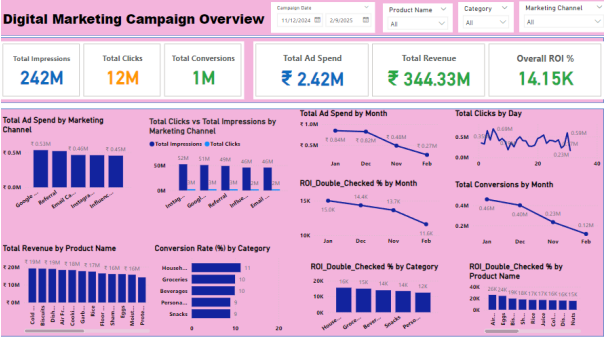

# Digital Marketing Campagin Analysis

## Table of Content

- [Project Overview](#project-overview)
- [Objectives](#objectives)
- [Key Business Questions](#key-business-questions)
- [Tools and Methodologies](#tools-and-methodologies)
- [Key Insights](#key-insights)
- [Summary & Recommendations](#summary-&-recommendations)
- [References](#references)

 ## Project Overview
  This project evaluates the performance of a digital marketing campaign in India using Microsoft Power BI. With 242M impressions,the campaign achieved exceptionally wide visibility.However, a deep dive into the data revealed a critical data integrity issue: the raw dataset incorrectly summed up individual row-level ROIs, leading to an inflated total that misrepresented actual performance. To establish a reliable source of truth, I created a custom DAX measure to calculate the true weighted ROI. The corrected analysis confirms that the campaign was incredibly profitable and cost-effective, driven by high revenue generation. The key recommendations are to Increase ad spend on top-performing product categories that yield both high ROI and substantial revenue, Introduce targeted incentives, such as limited-time discounts, to convert high-intent users who clicked the ads but did not complete a purchase—effectively narrowing the gap between total clicks and total conversions.
   

## Objectives
The main objectives for this campaign is to:
- Drive Brand Visibility
- Maximize Sales & Revenue 
- Optimize Conversion Efficiency 
- Achieve High Profitability (ROI )

## Key Business Questions
1. How effectively are we turning displays into clicks and clicks into sales?
2. Which categories are delivering the highest ROI?
3. Is the campaign profitable?

## Tools and Methodologies
*Tool Used:* *Microsoft Power BI* [Website](https://www.microsoft.com/en-us/power-platform/products/power-bi)

### Techniques
1. DAX Implementation for advanced calculations and metrics
2. Data Visualization for interactive and insightful dashboards
3. Comprehensive Project Documentation for clear reporting of insights

## Key Insights
1. *How effectively are we turning displays into clicks and clicks into sales?*
An exceptional 5.09% CTR proves the ads caught the right eyes, and a strong 9.81% Conversion Rate proves the landing pages successfully closed the deal.

